# **LLM-Enhanced Tarpit Detection and Escape：大模型增强的 UI Tarpit 检测与脱离**

王逸婷 毕云天 张弛

> Abstract: 近十年来，有关移动应用自动化测试的研究不断涌现，其中Kea作为一种基于PBT的移动应用自动化遍历测试工具，正在得到业界广泛应用。但是，此工具在遍历过程中时常会遇到探索过程停滞的问题，导致软件输入空间无法充分覆盖，这种问题被称为UI Tarpit。
>
> 我们的工作提出了一种判断和脱离UI Tarpit的策略，从而可以帮助Kea减少UI Tarpit带来的负面影响，有机会探索更多的软件功能。我们提出的技术方案包括两部分：Tarpit检测，通过解析页面结构，提取关键元素（按钮、输入框等），判断可能的坑类型；Tarpit脱离，对于简单Tarpit使用启发式策略（如寻找并点击按钮）即可成功导航；对于复杂坑页面（如表单），我们则使用大语言模型（Large Language Models, LLMs）借助上下文语义生成复杂跳坑事件序列。
>
> 我们在4种开源安卓应用上评估了本方法，结果表明，我们的策略能够有效地减少UI Tarpit出现的频率和跨度，与基线方法相比，UI Tarpit持续总时长降低了50%以上。对评估结果进行分析后，我们发现，本方法对UI Tarpit的快速检测和响应能够避免一部分UI Tarpit的产生；与此同时，基于LLM的表单填写策略也具有较高的成功率，这使得Kea有机会探索更多的软件功能。

Github: https://github.com/OcteneXin/kea-test

# I Introduction

移动应用自动化测试越来越复杂，传统方法难以应对APP界面的多样性和动态变化。在实际测试中，测试人员常会注意到UI Tarpit问题，它会导致自动化测试工具陷入局部页面，难以充分覆盖APP输入空间，从而阻碍代码覆盖度等测试指标的提升。

UI Tarpit的概念首次提出于W. Wang等人的论文[1]，指的是一类使得AIG（Auto Input Generation）工具难以继续探索的页面，也就是“花费大量时间的小部分页面” [1] 。此论文的团队提出了一种UI Tarpit预防工具***VET***，它基于静态序列分析，运用算法识别序列中隐含的两种UI坑（Exploration Space Partition和Excessive Local Exploration），再**禁用**导致UI坑的元素（如登出按钮等），从而在接下来的实验中防止UI Tarpit的出现。基于***VET***的工作，另一个研究团队提出了***AURORA***，它基于机器学习和图像分类方法，通过分析页面设计基序（ design motifs）来执行对应的启发式脚本，从而脱离出UI Tarpit。

这两种实现途径都有其局限性：***VET***需提前运行一次以获取事件序列，分析序列后才能识别出相关控件并禁用；另外，简单地禁用这些控件可能会导致一部分输入空间无法探索。而***AURORA***通过骨架屏识别页面类型，并不十分可靠，而且针对各种页面编写的启发式脚本是固定的，无法根据特定应用做出改变，泛用性很差。

结合***VET***的序列分析算法和***AURORA***的分类跳坑策略，我们提出了UI Tarpit**快速动态检测**和**分类脱离策略**相结合的思路，从抽象策略出发，规避了***AURORA***泛用性差的问题，同时对于复杂导航任务（如表单）使用LLM，能够有效地处理多变的实际应用场景。

# II UI Tarpit

我们分析了实验中出现的UI Tarpit，总结了几种常见且通用的坑类型（授权、系统、模态框、表单），详细例子和解释如下：

## Permission

特征：当前Activity名为`GrantPermissionsActivity`；页面上有一个模态框，底部有“Allow”和"Deny"两个按钮。

症状：程序常常点击"Deny"按钮，导致：1) 后续需要权限的操作无法进行，程序卡死；2) 自动遍历工具错误点击相关组件，进入系统设置页面，无法离开。

策略：寻找并点击正面按钮（一般为`allow`）。

例子：AnkiDroid（在此坑中卡顿96步以上）

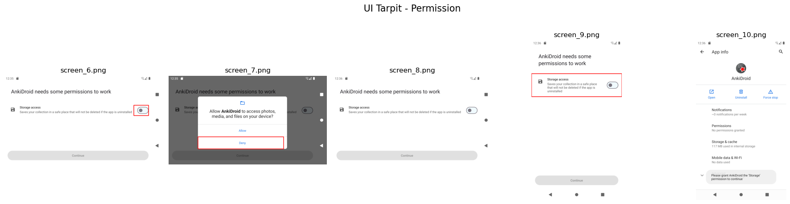

解释：这幅图展示了Permission坑的第二种症状。程序在点击“Deny”后，下一个random事件是点击“Storage access”列表项，这时就会进入安卓系统的"App Info"页面，而这个页面上可点击的元素很多，整个遍历就会彻底陷入安卓的系统页面中。

## System

特征：当前Activity名的包名为`google`或`android`；一看就不是待测程序的页面。

症状：由于这种页面的可交互元素多，一旦在开始时没有及时返回，之后程序就会在这种页面中遍历，很难回到待测程序中去了。

策略：一旦发现页面栈顶端的Activity属于系统级Activity，立刻按BACK键返回。

例子：AnkiDroid（在此坑中卡顿179步以上）

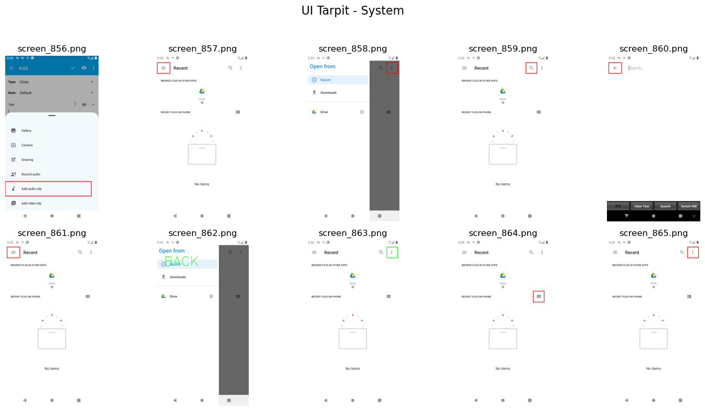

解释：这幅图中，程序点击了"Add audio clip"，尝试插入一个音频文件。打开安卓的文件浏览页面后（screen_857），程序直接就在其中进行遍历了，直到“screen-1035”才返回AnkiDroid，中间这179步白白浪费了。

## Modal

特征：同时存在一个正面按钮（如`save`、`confirm`、`ok`）和一个负面按钮（如`cancel`、`deny`），常常意味着这是一个需要用户手动确认的操作。

症状：1) 程序常常不会去点正面按钮，导致模态框指示的操作失效，这会降低探索到其他功能的可能性；2) 程序在模态框**内部**的元素打转，但迟迟不点确认按钮，或最后点了取消按钮，前功尽弃。

策略：发现正负按钮并存，20%概率随机探索，40%概率点击正面按钮，40%概率点击负面按钮。

例子：Omninote（在此坑中卡顿19步以上）

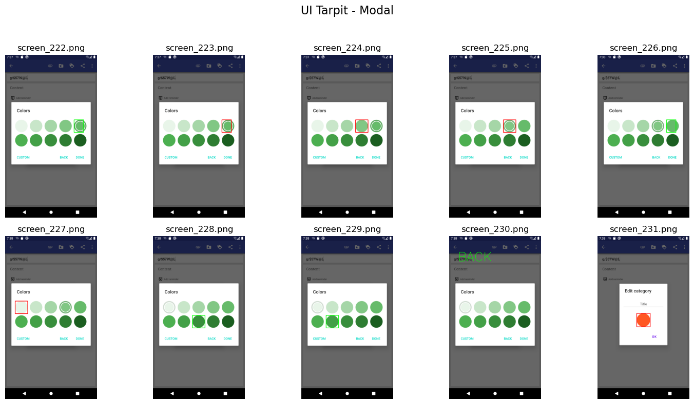

解释：这是Modal表现出的第二种症状，程序只在Modal内部的元素上点击，迟迟不按确认按钮（“Done”），最后在第230行按下了“Back”，前功尽弃。

## Form

特征：同时存在一个正面按钮（如`save`、`confirm`、`ok`）和一个负面按钮（如`cancel`）以及一个及以上的输入框（安卓的TextView组件），这些要素往往可以组成一张供用户填写的表单。

症状：1) 如同其他论文提到的那样，自动遍历工具生成文本的能力很差，往往无法满足其格式或语义要求；2) 与Modal的问题相同，点到正面按钮的概率不高，又加上了“表单必须填完且正确”的前提，让表单成功提交变得非常困难；3）有些自动遍历工具会把内含**不同文本内容**的输入框认为是两个**不同的元素**，导致刚刚探索过的输入框又被探索，如此反复，最后难以离开表单页面。

策略：发现正负按钮并存且输入框个数`>=1`，并且10个事件内没有询问过大模型，就将当前页面编码为html，组装好提示词后发给大模型（glm-4-plus），解析response的事件列表，在以下的若干轮尝试执行；如果近期询问过大模型，那么随机点击一个正面或负面按钮即可（这样也有概率能脱离表单）。

例子：Omninote（在此坑中卡顿47步以上）

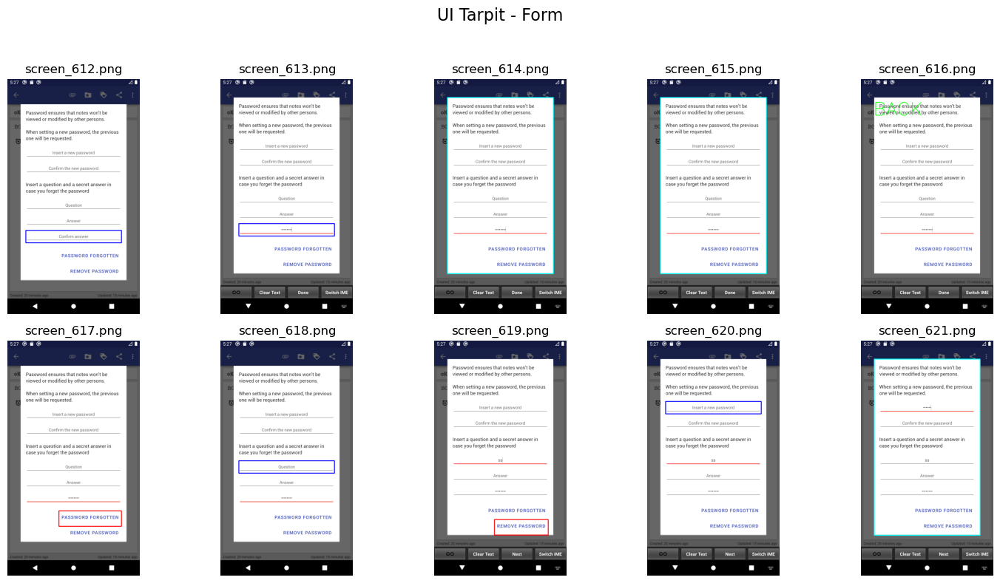

解释：此页面有5个输入框，互相之间具有强相关上下文（密码-确认密码；安全问题-答案-确认答案），并且判定条件非常严格（2=3, 4=5，1~5均不为空），只凭借random策略根本不可能正确填写此表单，相反的，程序会被这5个输入框长期困在其中，难以返回外部页面。

# III Approach

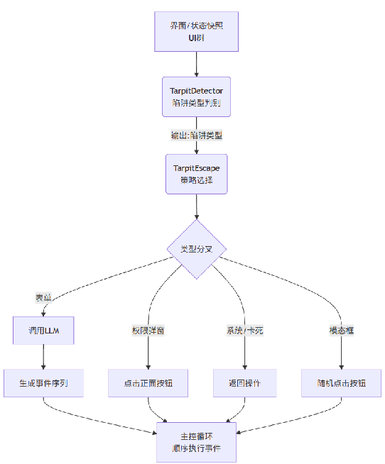

## 多粒度判坑（tarpit_detector）

1. 授权：特征为`GrantPermissionsActivity`结尾的页面
2. 系统页面：除了`NexusLauncherActivity`桌面以外的，包名的第二个单词不为`amaze`的页面
3. 表单：有`>=2`个按钮**和**`>=1`个输入框
4. 模态框：同时包含正面和负面按钮
   1. 正面：'yes','apply','allow','ok','submit','save','commit','confirm','create','delete'
   2. 负面：'no','cancel','deny'
6. 卡住：连续相同Activity数量`>=10`

## 联合跳坑策略（tarpit_escape）

1. 授权：寻找并点击正面按钮（一般为`allow`）
2. 系统页面：按下`BACK`键
3. 表单
   1. 在冷却期（距离上一次llm不到10个事件）：随意按下一个按钮（为了防止抖动问题）
   2. 不在冷却期：页面编码->合成提示词->等待llm->生成操作序列
4. 模态框：
   1. 80%概率：随意按下一个按钮
   2. 20%概率：生成随机事件（有机会探索模态框内部元素）
5. 需要重启：卸载并重新安装应用
6. 卡住：按下`BACK`键

### LLM 工作流程

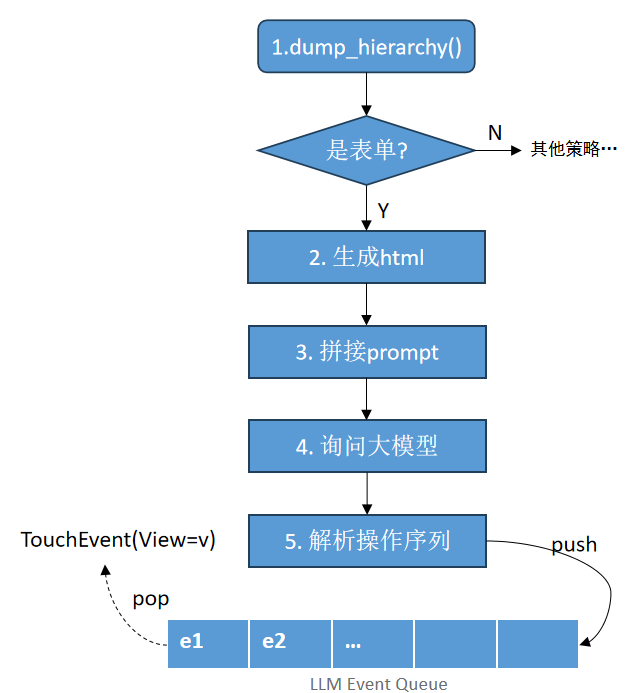

1. 调用dump_hierarchy()拉取页面xml，解析xml树，提取叶子节点
2. 如果判断当前页面为表单，按元素类型生成html文本
3. 拼接Prompt，等待LLM回复
4. 解析LLM提供的操作序列，转换为Kea可识别的Event类型，放入LLM事件队列中
5. 依次从队列取事件并执行，直到队列为空

#### HTML Encoding

研究[1]表明，由于LLM的训练数据大多是HTML类型的文本，使用HTML文本描述UI结构（而不是自然语言）时，LLM的表现会更佳。(Researchers have found that LLMs are better at under standing HTML than natural-language-described UIs due to the large amount of HTML code in the training data of LLMs.)

另一方面，xml文件的规模一般较大，包含大量的标签文本（<node></node>）和上下文无关信息（scrollable，clickable等），其中较为关键的有：

1.class：控件种类（ImageView, TextView等）

2.text：控件文本

3.content-desc：控件描述，作为补充内容

我们使用论文[2]的方法进行html编码。

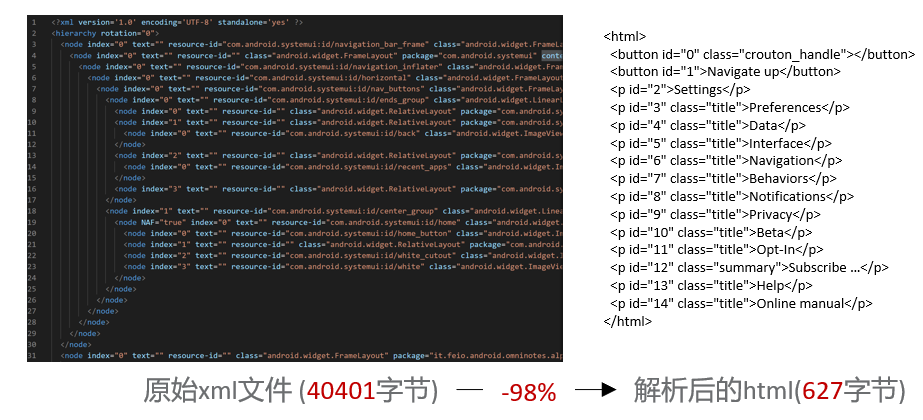

#### Prompt

Prompt的组成部分有：

1.任务：作为用户，我们“碰到(encountered)”了一个表单，要求大模型给出一系列操作序列,去将表单填写完整(fill out)。这一部分的关键是从用户的角度出发，因为大模型往往会尽可能满足用户需求。

2.输出格式化：使用One-shot方法，要求大模型只输出预定义的JSON格式，方便后续解析。

3.表单内容：将解析后的html文本插入Prompt。与直接发送xml相比，这将大大减少Prompt消耗的Token数量。

**Prompt 示例**：

```python
fill_out_form_prompt = f"""
I encountered a form when I use an App. The form will be given in HTML format. Please generate a list of operations to fill out this form. Your answer should be JSON format, like this:
{json_response_format}
The form is:
<form_content>
"""
```

**JSON 输出示例**：

```json
{
    "operations":[
        {
            "id": 1,
            "resource_id" : "username"
            "event": "input",
            "text": "admin"
        },
        {
            "id": 2,
            "resource_id" : "password"
            "event": "input",
            "text": "123456"
        },
        {
            "id": 7,
            "resource_id" : "button2"
            "event": "click"
        }
    ]
}
```

# IV Evaluation

## Research Questions (RQs)

1. 基线方法遇到UI坑的频率有多大，最容易成为UI坑的是哪些类型的页面？
2. LLM方法与基线方法相比，能多大程度地提升代码覆盖度？
3. LLM方法能够减少多少UI坑的影响？
4. LLM方法能够多大程度地提升探索到的功能多样性？

## A. Evaluation Context

### Dataset

| APK              | Type     | Description                | Usage           |
| ---------------- | -------- | -------------------------- | --------------- |
| AmazeFileManager | 文件管理 | 基本正常                   | RQ2/RQ1/RQ3/RQ4 |
| AnkiDroid        | 学习     | 插桩数据**异常**           | RQ1/RQ3/RQ4     |
| Markor           | 文本编辑 | 未插桩                     | RQ1/RQ3/RQ4     |
| Wikipedia        | 文章浏览 | 需要**联网**，其他基本正常 | /               |
| Omninotes        | 笔记     | 未插桩                     | RQ1/RQ3/RQ4     |

### Methods

我们使用修改过的[Kea](https://github.com/ecnusse/Kea)，输入不同的运行参数：

- `random-1000`：**Baseline（基线方法）**，使用Kea自带的随机策略连续运行1小时，中途不重启
- `random-100`：Kea默认的跳坑策略，连续运行1小时，中途每100个事件重启一次
- `llm`：大模型辅助跳坑策略，连续运行2小时，中途不重启

### Experimental Procedure

对于`AmazeFileManager`，我们测试所有的三种策略，每种策略运行5次，收集页面事件数据和覆盖度数据；对于`Markor`、`AnkiDroid`、`Omninotes`，我们测试两种策略：Baseline和LLM，前者运行1次，后者运行2次，仅收集页面事件数据。

为了保证三种策略生成事件数的一致性，考虑到LLM策略生成事件的速率是另外两种策略的0.5倍，我们设置LLM策略的单次运行时间为2h，另外两种策略为1h。对于单个应用，应始终使用同一个性质文件（仅含initialize部分，没有有效的rule），避免性质带来的影响。另外，我们禁止了屏幕旋转事件，以最大程度地节省事件数量。单次测试运行结束后，重启整个脚本并手动结束相关后台程序，避免内存占用所带来的影响。

#### Metrics

RQ1：分析Baseline页面截图，计算图片感知哈希相似度并使用DBSCAN进行聚类，根据聚类ID连续重复出现的次数筛选所有UI坑页面，人工识别并统计各个UI Tarpit的页面类型；

RQ2：使用JacocoCli处理覆盖度文件，每5分钟合并累加计算`line  branch  method  class`四种覆盖度数据，5次实验取平均值，最后将三种策略的平均值绘制为柱状图进行比较；

RQ3：基于RQ1的数据，统计LLM策略与基线方法相比的UI Tarpit相关指标，并使用时间线图进行可视化；

RQ4：统计所有event的按钮/控件文本并去重，并使用大模型方法标注各个按钮/控件可能对应的功能类型，从而比较LLM与Baseline所涉及到的软件功能集合是否有显著差异。

## B. RQ1：How often UI tarpit occurs?

我们从4个应用的`Random-1000`策略（Baseline）各随机抽取一次实验结果，进行图像相似度聚类分析，选出`Cluster ID`重复大于10次的序列（这表明有连续10个以上页面视觉上相似，如图1所示），统计出常见UI Tarpit类型，如表3所示。其中，文本编辑页面总停顿步数是最多的，但这取决于特定应用（`Markor`和`Omninotes`都是文本编辑软件）；列表多选页面（出现在`AnkiDroid`）和列表浏览页面（出现在`AmazeFileManager`）同样只与特定应用有关，缺乏一般性。

我们的Approach能够检测并处理的UI Tarpit由黑体标出。而这些UI Tarpit在4个应用中都有出现，可以证明本方法的有效性，因为这些UI Tarpit并不局限在几个特定类型的应用中。

值得注意的是，授权页面不在这个列表中，因为实验时使用了`-grant_perm`参数，自动赋予了所有权限，因此一般不会弹出授权弹窗，从而也就不会进入与之相关的Tarpit。

<div style="text-align:center">表3 Baseline实验过程中出现的UI Tarpit。粗体为本方法能够处理的Tarpit类型。<div/>


|                                      | 总停顿步数 | 最长停顿长度 |
| ------------------------------------ | ---------- | ------------ |
| 列表多选页面（List Multi-Selection） | 301        | 58           |
| **表单页面（Form）**                 | 107        | 48           |
| **模态框页面（Modal）**              | 116        | 29           |
| 文本编辑页面（Text Edit）            | 743        | 312          |
| 列表浏览页面（List Browser）         | 220        | 18           |
| 设置页面（Settings）                 | 62         | 40           |
| 搜索页面（Search）                   | 79         | 12           |
| **其他系统页面（System）**           | 11         | 11           |


<div style="text-align:center">图1 表单类型的UI Tarpit，来自于Omninotes<div/>


## C. RQ2: Code coverage improvement?

在同等事件个数下，代码覆盖度可以一定程度上体现探索策略的效率。为了定量地评估本方法的有效性，在事件数相同（约600个）的前提下，我们将LLM策略与`random-1000`（Baseline）、`random-100`进行代码覆盖度比较，包括语句覆盖（line）、分支覆盖（branch）、方法覆盖（method）和类覆盖（class）。为了避免随机性的影响，每种策略运行5次取平均值，结果如表4所示。可以看出，llm方法除了在分支覆盖上比baseline略有下降，其他三种覆盖度均略高于baseline，原因可能为：1) llm方法成功完成表单/完成模态框会成功触发业务相关的函数，而baseline方法难以成功完成复杂业务，从而较少触发相关逻辑；2) llm方法能够预防并跳出一些UI Tarpit，有效减少了程序在UI Tarpit停顿的时间，从而有更多的时间去探索新功能。

而`random-100`作为Kea的默认跳坑策略，其通过重启的方式让程序跳出UI坑，但其各个指标都低于baseline和llm方法，可能的原因是每100个事件重启一次导致程序探索深度不足，从而无法访问到深层的功能点。

由于只有`AmazeFileManager`可供测试，这些代码覆盖度数据可能不具有很高的代表性。另外，也无法保证llm方法与另外两种方法的事件数完全相同，这同样会对结果造成一些影响。

<div style="text-align:center">表4 三种策略的代码覆盖度，在AmazeFileManager上测试<div/>


|                       | line   | branch | method | class  |
| --------------------- | ------ | ------ | ------ | ------ |
| random-1000(baseline) | 29.5   | 21.534 | 37.086 | 45.356 |
| random-100            | 22.728 | 16.172 | 29.882 | 39.308 |
| llm                   | 29.49  | 20.762 | 38.122 | 46.524 |

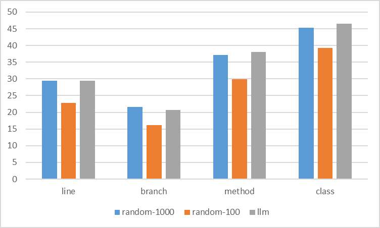

<div style="text-align:center">图2 代码覆盖度柱状图<div/>


## D. RQ3: UI tarpit diminished?

基于RQ1的聚类结果，我们统计了所有4个待测APK的LLM策略和Baseline的UI坑指标，包括：1) UI坑数量（UI Tarpit Count, TC）2) 总长度（Total UI Tarpit Length, TL）3) 最大长度（Max UI Tarpit Length, ML）4) UI坑占所有事件数的比例（UI Tarpit Ratio, TR）。统计结果如表5所示。

对于`AnkiDroid`、`Markor`和`Omninotes`，其各项UI Tarpit指标均明显下降，尤其是最后一列的UI Tarpit Ratio下降比例均大于50%，这意味着llm策略能够在这些应用上减少一半在UI Tarpit中停留的时间，跳坑效果显著；一个反例是`Amaze`，使用了llm之后，UI Tarpit指标有所上升，但数值上的增加并不多，推测可能是Amaze的UI Tarpit基数本身较小导致的，使得llm的跳坑作用不明显。

我们还根据聚类ID和时间序列画出了4个应用的时间线图（图3），展示了Baseline和llm方法的探索情况差异。其中，高亮的部分为UI Tarpit。从图中可以观察到使用llm方法后，除了AmazeFileManager外的各个应用，其UI Tarpit数量和长度均有所减少。

<div style="text-align:center">表5 4个待测APK的UI Tarpit指标在Baseline和llm方案上的差异<div/>


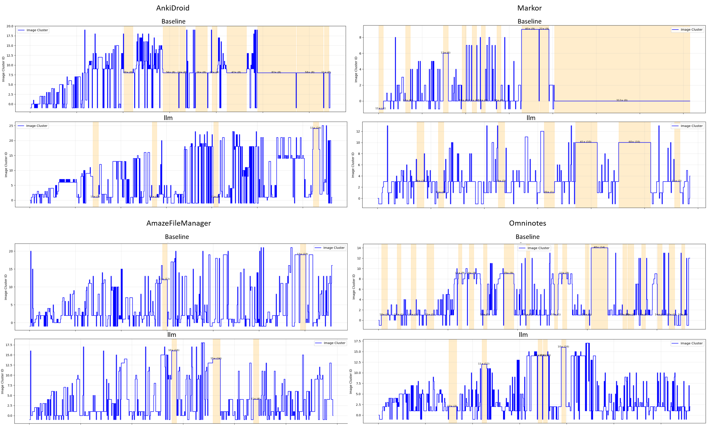

<div style="text-align:center">图3 4个待测应用使用llm前后的时间线图<div/>


## E. RQ4: Function diversity increased?

为了获取遍历过程中探索到的软件功能，我们解析了测试过程中产生的所有event并提取按钮描述`content_description`和控件文本`text`，初步提取为预定义软件功能类别表，如表6所示：

<div style="text-align:center">表6 预定义软件功能类别表<div/>


| id   | 类别      | 示例描述/文本                                                |
| ---- | --------- | ------------------------------------------------------------ |
| 1    | 增删改查  | `Save`, `Create a new file`, `Delete`, `Copy`, `Move`, `Add tags`, `Create Toolbar Item`, `Delete Bookmark` |
| 2    | 文本编辑  | `Bold`, `Italic`, `Strike out`, `Heading 1`,`Table`, `Horizontal line`, `Ordered list`,`Document End` |
| 3    | 格式设置  | `Date format`, `Choose format`, `yyyy-MM-dd`                 |
| 4    | 导航跳转  | `Go to`, `QuickNote`, `Log in`                               |
| 5    | 页面操作  | `More options`, `drawer open`, `Sort`, `Collapse`, `Select all`, `Sort Field`, `List view` |
| 6    | 搜索替换  | `Search`, `Replace`, `SEARCH / REPLACE`, `Clear query`       |
| 7    | 配置/设置 | `Load default settings`, `Always use...`, `Keep Editing`     |
| 8    | 一般按钮  | `OK`, `CANCEL`, `HELP`                                       |
| 9    | 其他      | 用户输入的文本、页面提示文字等，`Nothing here!`, `oKgUJ\ny\n\n#Tag1`, `FF8BC34A`, `Open the deck ` |

<div style="text-align:center">表7 4个待测应用使用llm策略前后的各类别软件功能数对比<div/>


根据表6定义的规则，我们随机抽取每个待测软件`Baseline`和`llm`策略各一个测试结果，统计所有event的按钮描述和控件文本，并使用`ChatGPT-4o`进行标注（见附录5）和统计。与此同时，统计每种方法所遍历的Activity数，因为不同Activity往往也对应着不同的软件功能。最终结果如表7所示。

从表中可知，`AnkiDroid`和`Markor`在使用llm策略后，探索到的软件功能数有所上升，其中类型1（增删改查）和类型4（导航跳转）的重要性更高，提升比例也较为明显；但是，另外两个待测应用则有所下降，这可能与软件功能的统计方式有关，也有可能是随机因素引起。


# Reference

[1] W. Wang, W. Yang, T. Xu, and T. Xie, “VET: Identifying and Avoiding UI Exploration Tarpits,” in ESEC/FSE, 2021.

[2] Feng S, Chen C. Prompting is all you need: Automated android bug replay with large language models[C]//Proceedings of the 46th IEEE/ACM International Conference on Software Engineering. 2024: 1-13.

[3] [Li, Yuanchun, et al. "DroidBot: a lightweight UI-guided test input generator for Android." In Proceedings of the 39th International Conference on Software Engineering Companion (ICSE-C '17). Buenos Aires, Argentina, 2017.](http://dl.acm.org/citation.cfm?id=3098352)

[4] Wen H, Li Y, Liu G, et al. Autodroid: Llm-powered task automation in android[C]//Proceedings of the 30th Annual International Conference on Mobile Computing and Networking. 2024: 543-557.

[5] Liu Z, Li C, Chen C, et al. Vision-driven automated mobile gui testing via multimodal large language model[J]. arXiv preprint arXiv:2407.03037, 2024.

[6] Liu Z, Chen C, Wang J, et al. Make llm a testing expert: Bringing human-like interaction to mobile gui testing via functionality-aware decisions[C]//Proceedings of the IEEE/ACM 46th International Conference on Software Engineering. 2024: 1-13.

[7] Yoon J, Feldt R, Yoo S. Intent-driven mobile gui testing with autonomous large language model agents[C]//2024 IEEE Conference on Software Testing, Verification and Validation (ICST). IEEE, 2024: 129-139.

[8] Liu Z, Chen C, Wang J, et al. Fill in the blank: Context-aware automated text input generation for mobile gui testing[C]//2023 IEEE/ACM 45th International Conference on Software Engineering (ICSE). IEEE, 2023: 1355-1367.

# 附录

## 附录1 Environment

|            | 值          | 备注          |
| ---------- | ----------- | ------------- |
| 电脑系统   | Windows10   |               |
| 安卓版本   | Android10.0 | 模拟器        |
| Python版本 | Python3.9.4 | conda虚拟环境 |
| 终端       | git bash    | 管理员身份    |

### 待测APK包名及版本

| App name  | apk                            | Package name                    |
| --------- | ------------------------------ | ------------------------------- |
| Omninotes | omninotes.apk                  | it.feio.android.omninotes.alpha |
| Markor    | markor-2.8.5-#1698.apk         | net.gsantner.markor             |
| AnkiDroid | AnkiDroid-amazon-x86-debug.apk | com.ichi2.anki.debug            |
| Amaze     | AmazeFileManager.apk           | com.amaze.filemanager.debug     |

### 环境变量

| 字段               | 值                                        | 备注                  |
| ------------------ | ----------------------------------------- | --------------------- |
| `ANDROID_HOME`     | `D:\AndroidSDK`                           |                       |
| `PATH`             | `%ANDROID_HOME%\cmdline-tools\latest`     |                       |
|                    | `%ANDROID_HOME%\emulator`                 |                       |
|                    | `%ANDROID_HOME%\cmdline-tools\latest\bin` |                       |
|                    | `%ANDROID_HOME%\platform-tools`           |                       |
|                    | `%ANDROID_HOME%\build-tools\29.0.3`       | aapt                  |
| `MSYS_NO_PATHCONV` | 1                                         | git bash 禁止路径转换 |

### 文件夹结构

- KeaPlus-Evaluation：放F盘根目录下，即`F:\KeaPlus-Evaluation`
  - AmazeFileManager
    - `AmazeFileManager.apk`：待测apk
  - scripts
    - example
      - `example_property.py`：保证程序顺利初始化
    - output#datetime：kea输出文件夹
      - all_states：所有状态截图和json
    - output2：覆盖度根目录
      - AmazeFileManager.apk.kea.result.emulator-5554.Android10.0#datetime：单次测试覆盖度文件所在文件夹
        - `all_coverage.csv`：覆盖度报告
        - `coverage_1.ec`：拉取的覆盖度文件
    - `dump_coverage.sh`：拉取覆盖度文件的脚本，5分钟一次
    - `run_Kea.sh`：总运行脚本
    - `coverage_diff_tool.py`：计算一次测试的覆盖度
    - `coverage_diff_tool_average.py`：计算多次测试覆盖度平均值
  - tools
    - `jacococli.jar`：用于生成覆盖度报告


## 附录2 相关脚本

### 覆盖度实验

#### run_kea.sh

```bash
APK_PATH="$1"
DEVICE_SERIAL="$2"
AVD_NAME="$3"
OUTPUT_PATH="$4"
TEST_TIME="$5"
PROPERTY_FILE_PATH="$6"
RESTART_EVENTS_NUMBER="$7"
POLICY="$8"

...

# 运行Python脚本并传递参数
kea -d "$DEVICE_SERIAL" -f "$PROPERTY_FILE_PATH" -a "$APK_PATH" -t "$TEST_TIME" -o "output#$current_date_time" -n "$RESTART_EVENTS_NUMBER" -p "$POLICY" -grant_perm -disable_rotate
```

参数解释：

- `APK_PATH`：被测apk路径
- `DEVICE_SERIAL`：安卓模拟器序列号，一般为`emulator-5554`
- `AVD_NAME`：安卓设备名，一般为`Android10.0`
- `OUTPUT_PATH`：覆盖度输出路径`output2`，不是kea输出路径
- `TEST_TIME`：单次执行时间，一般为`3600`（秒）
- `PROPERTY_FILE_PATH`：性质文件路径，一般为`./example/example_property.py`
- `RESTART_EVENTS_NUMBER`：多少事件数后重启
- `POLICY`：导航策略，有`random`和`llm`两种选择
- `-grant_perm`：赋予全部权限（不一定有用）
- `-disable_rotate`：禁止旋转事件

#### property

```python
from kea import *

class Test1(KeaTest):

    @initializer()
    def pass_welcome_pages(self):
        d(resourceId="com.android.permissioncontroller:id/permission_allow_button").click()

    @precondition(lambda self: False)
    @rule()
    def search_bar_should_exist_after_rotation(self):
        pass
```

#### baseline

```bash
conda activate kea

cd F:\

cd KeaPlus-Evaluation/scripts

./run_Kea.sh "../AmazeFileManager/AmazeFileManager.apk" "emulator-5554" Android10.0 output2 3600 ./example/example_property.py 1000 random
```

#### random-100

```bash
conda activate kea

cd F:\

cd KeaPlus-Evaluation/scripts

./run_Kea.sh "../AmazeFileManager/AmazeFileManager.apk" "emulator-5554" Android10.0 output2 3600 ./example/example_property.py 100 random
```

#### llm

```bash
conda activate kea

cd F:\

cd KeaPlus-Evaluation/scripts

./run_Kea.sh "../AmazeFileManager/AmazeFileManager.apk" "emulator-5554" Android10.0 output2 7200 ./example/example_property.py 1000 llm
```

#### coverage

```bash
python coverage_diff_tool.py -dir F:\KeaPlus-Evaluation\scripts\output2
```

### 普通实验

#### emulator

```bash
emulator -avd Android10.0 -read-only -port 5554

# 开启weditor（可选）

conda activate kea
python -m weditor
```

#### Omninotes

性质（example_property_omninotes.py）

```python
from kea import *

class Test1(KeaTest):

    @initializer()
    def pass_welcome_pages(self):
        if d(text="Allow").exists():
            d(text="Allow").click()

        for _ in range(5):
            d(resourceId="it.feio.android.omninotes.alpha:id/next").click()
        d(resourceId="it.feio.android.omninotes.alpha:id/done").click()

        d(resourceId="it.feio.android.omninotes.alpha:id/fab_expand_menu_button").long_click()
        d(resourceId="it.feio.android.omninotes.alpha:id/detail_content").click()
        d(resourceId="it.feio.android.omninotes.alpha:id/detail_content").set_text("read a book #Tag1")
        d(description="drawer open").click()
        d(resourceId="it.feio.android.omninotes.alpha:id/note_content").click()

    @precondition(lambda self: False)
    @rule()
    def search_bar_should_exist_after_rotation(self):
        pass
```

脚本

```bash
kea -d "emulator-5554" -f example/example_property_omninotes.py -a example/omninotes.apk -t 7200 -n 1000 -p llm -grant_perm -disable_rotate -o output4

kea -d "emulator-5554" -f example/example_property_omninotes.py -a example/omninotes.apk -t 7200 -n 1000 -p llm -grant_perm -disable_rotate -o output41

kea -d "emulator-5554" -f example/example_property_omninotes.py -a example/omninotes.apk -t 3600 -n 1000 -p random -grant_perm -disable_rotate -o output42
```

#### Markor

性质（property_markor.py）

```python
from kea import *

class Test1(KeaTest):

    @initializer()
    def pass_welcome_pages(self):
        d(resourceId="net.gsantner.markor:id/next").click()
        d(resourceId="net.gsantner.markor:id/next").click()
        if(d(resourceId="android:id/button1").exists()):
            d(resourceId="android:id/button1").click()
        if(d(resourceId="com.android.permissioncontroller:id/permission_allow_button").exists()):
            d(resourceId="com.android.permissioncontroller:id/permission_allow_button").click()
        d(resourceId="net.gsantner.markor:id/next").click()
        d(resourceId="net.gsantner.markor:id/next").click()
        d(resourceId="net.gsantner.markor:id/next").click()
        d(resourceId="net.gsantner.markor:id/done").click()
        d(resourceId="net.gsantner.markor:id/fab_add_new_item").click()
        d(resourceId="net.gsantner.markor:id/new_file_dialog__name").set_text("test file")
        d(resourceId="android:id/button1").click()
        d(resourceId="net.gsantner.markor:id/document__fragment__edit__content_editor__scrolling_parent").set_text("test file content")
        d.go_back()


    @precondition(lambda self: False)
    @rule()
    def dummy(self):
        pass
```

脚本

```bash
kea -d "emulator-5554" -f example/property_markor.py -a "example/markor-2.8.5-#1698.apk" -t 3600 -n 1000 -p random -grant_perm -disable_rotate -o output5

kea -d "emulator-5554" -f example/property_markor.py -a "example/markor-2.8.5-#1698.apk" -t 7200 -n 1000 -p llm -grant_perm -disable_rotate -o output51

kea -d "emulator-5554" -f example/property_markor.py -a "example/markor-2.8.5-#1698.apk" -t 7200 -n 1000 -p llm -grant_perm -disable_rotate -o output52
```

#### AnkiDroid

性质(property_ankidroid.py)

```python
from kea import *

class Test(KeaTest):
    
    # Get through Permission
    @initializer()
    def set_up(self):
        d(resourceId="com.ichi2.anki.debug:id/get_started").click()
        d(resourceId="com.ichi2.anki.debug:id/switch_widget").click()
        if(d(resourceId="com.android.permissioncontroller:id/permission_allow_button").exists()):
            d(resourceId="com.android.permissioncontroller:id/permission_allow_button").click()
            d(resourceId="com.ichi2.anki.debug:id/continue_button").click()
        d.click(0.647, 0.713)

        d(resourceId="com.ichi2.anki.debug:id/fab_main").click()
        d(resourceId="com.ichi2.anki.debug:id/add_deck_action").click()
        d.xpath('//*[@resource-id="com.ichi2.anki.debug:id/dialog_text_input_layout"]/android.widget.FrameLayout[1]').set_text("i")
        d(resourceId="android:id/button1").click()

        d(resourceId="com.ichi2.anki.debug:id/fab_main").click()
        d(resourceId="com.ichi2.anki.debug:id/fab_main").click()
        d(resourceId="com.ichi2.anki.debug:id/id_note_editText", description="Front").set_text("aaa")
        d(resourceId="com.ichi2.anki.debug:id/id_note_editText", description="Back").set_text("bbb")
        d(resourceId="com.ichi2.anki.debug:id/note_deck_spinner").click()
        d(resourceId="com.ichi2.anki.debug:id/deckpicker_name", text="i").click()
        d(resourceId="com.ichi2.anki.debug:id/action_save").click()
        d(description="Navigate up").click()


    @precondition(
        lambda self: False
    )
    @rule()
    def dummy(self):
        pass
```

脚本

```bash
kea -d "emulator-5554" -f example/property_ankidroid.py -a "example/AnkiDroid-amazon-x86-debug.apk" -t 7200 -n 1000 -p llm -grant_perm -disable_rotate -o output6

kea -d "emulator-5554" -f example/property_ankidroid.py -a "example/AnkiDroid-amazon-x86-debug.apk" -t 7200 -n 1000 -p llm -grant_perm -disable_rotate -o output61

kea -d "emulator-5554" -f example/property_ankidroid.py -a "example/AnkiDroid-amazon-x86-debug.apk" -t 3600 -n 1000 -p random -grant_perm -disable_rotate -o output62
```


## 附录3 覆盖度实验数据

### baseline

#### Round1

time：2025-05-04-01-07-21

| #    | line  | branch | method | class |
| ---- | ----- | ------ | ------ | ----- |
| 1    | 18.31 | 13.07  | 24.73  | 35.85 |
| 2    | 20.64 | 14.45  | 27     | 37.58 |
| 3    | 21.35 | 14.67  | 27.95  | 38.23 |
| 4    | 22.52 | 15.86  | 29.27  | 38.88 |
| 5    | 23.87 | 16.86  | 30.47  | 39.52 |
| 6    | 24.16 | 17.1   | 31.07  | 39.74 |
| 7    | 24.25 | 17.16  | 31.18  | 39.74 |
| 8    | 24.32 | 17.19  | 31.29  | 39.74 |
| 9    | 27.15 | 19.35  | 34.66  | 42.98 |
| 10   | 27.15 | 19.35  | 34.66  | 42.98 |
| 11   | 28.11 | 19.96  | 35.76  | 43.63 |
| 12   | 28.63 | 20.43  | 36.61  | 44.49 |


#### Round2

time：2025-05-04-10-08-12

| #    | line  | branch | method | class |
| ---- | ----- | ------ | ------ | ----- |
| 1    | 18.66 | 12.8   | 25.4   | 36.07 |
| 2    | 22.64 | 15.8   | 30.33  | 40.17 |
| 3    | 24.54 | 17.56  | 32.17  | 41.47 |
| 4    | 25.3  | 18.23  | 33.06  | 41.9  |
| 5    | 25.3  | 18.23  | 33.06  | 41.9  |
| 6    | 26.11 | 18.75  | 33.95  | 41.9  |
| 7    | 26.72 | 19.04  | 34.44  | 42.76 |
| 8    | 26.96 | 19.16  | 34.48  | 42.76 |
| 9    | 27.73 | 19.64  | 35.3   | 43.2  |
| 10   | 27.73 | 19.64  | 35.3   | 43.2  |
| 11   | 27.73 | 19.64  | 35.3   | 43.2  |
| 12   | 28.2  | 19.96  | 35.51  | 43.41 |


#### Round3

time：2025-05-04-17-56-52

| #    | line  | branch | method | class |
| ---- | ----- | ------ | ------ | ----- |
| 1    | 17.98 | 12.61  | 23.73  | 33.91 |
| 2    | 20.99 | 15.11  | 27.63  | 38.01 |
| 3    | 22.66 | 16.26  | 29.34  | 38.66 |
| 4    | 23.56 | 16.88  | 30.22  | 39.31 |
| 5    | 24.4  | 17.45  | 30.97  | 39.74 |
| 6    | 27.22 | 19.62  | 34.55  | 42.98 |
| 7    | 27.84 | 20.18  | 35.3   | 43.41 |
| 8    | 27.84 | 20.18  | 35.3   | 43.41 |
| 9    | 28.47 | 21.28  | 35.65  | 43.63 |
| 10   | 28.74 | 21.59  | 35.76  | 43.63 |
| 11   | 28.74 | 21.61  | 35.76  | 43.63 |
| 12   | 28.98 | 21.76  | 36.22  | 44.28 |


#### Round4

time：2025-05-04-19-01-26

| #    | line  | branch | method | class |
| ---- | ----- | ------ | ------ | ----- |
| 1    | 19.95 | 13.92  | 26.53  | 36.72 |
| 2    | 22.11 | 15.83  | 28.59  | 38.66 |
| 3    | 22.7  | 16.2   | 29.02  | 38.88 |
| 4    | 22.86 | 16.4   | 29.16  | 38.88 |
| 5    | 24.95 | 18.21  | 31.82  | 40.82 |
| 6    | 25.9  | 18.83  | 32.67  | 41.47 |
| 7    | 26.21 | 19.24  | 32.99  | 41.47 |
| 8    | 28.75 | 21.29  | 36.04  | 45.14 |
| 9    | 29.26 | 21.75  | 36.61  | 45.36 |
| 10   | 29.53 | 22.02  | 36.93  | 45.57 |
| 11   | 29.56 | 22.04  | 36.96  | 45.79 |
| 12   | 30.02 | 22.45  | 37.32  | 46    |


#### Round5

time：2025-05-04-20-11-18

| #    | line  | branch | method | class |
| ---- | ----- | ------ | ------ | ----- |
| 1    | 19.58 | 13.48  | 26.53  | 36.5  |
| 2    | 21.02 | 15.15  | 27.7   | 37.15 |
| 3    | 26.71 | 18.71  | 34.41  | 44.28 |
| 4    | 27.89 | 19.49  | 35.93  | 45.14 |
| 5    | 29.36 | 20.68  | 37.35  | 46.44 |
| 6    | 30.34 | 21.7   | 38.24  | 47.3  |
| 7    | 30.54 | 22.05  | 38.56  | 47.3  |
| 8    | 30.62 | 22.19  | 38.7   | 47.52 |
| 9    | 31.42 | 22.82  | 39.48  | 48.6  |
| 10   | 31.67 | 23.03  | 39.77  | 48.6  |
| 11   | 31.67 | 23.07  | 39.77  | 48.6  |
| 12   | 31.67 | 23.07  | 39.77  | 48.6  |


#### Average

| #    | line  | branch | method | class  |
| ---- | ----- | ------ | ------ | ------ |
| 1    | 28.63 | 20.43  | 36.61  | 44.49  |
| 2    | 28.2  | 19.96  | 35.51  | 43.41  |
| 3    | 28.98 | 21.76  | 36.22  | 44.28  |
| 4    | 30.02 | 22.45  | 37.32  | 46     |
| 5    | 31.67 | 23.07  | 39.77  | 48.6   |
| avg  | 29.5  | 21.534 | 37.086 | 45.356 |


### random-100

#### Round1

time：2025-05-04-09-39-52

| #    | line  | branch | method | class |
| ---- | ----- | ------ | ------ | ----- |
| 1    | 1.58  | 1.49   | 2.23   | 4.32  |
| 2    | 6.54  | 6.05   | 9.83   | 14.04 |
| 3    | 6.66  | 6.1    | 10.04  | 14.25 |
| 4    | 8.45  | 7.26   | 12.03  | 17.71 |
| 5    | 17.71 | 12.08  | 24.76  | 35.21 |
| 6    | 17.71 | 12.08  | 24.76  | 35.21 |
| 7    | 18.51 | 12.74  | 25.26  | 35.64 |
| 8    | 18.54 | 12.74  | 25.29  | 35.64 |
| 9    | 18.61 | 12.74  | 25.4   | 35.64 |
| 10   | 18.61 | 12.74  | 25.4   | 35.64 |
| 11   | 19    | 12.9   | 25.86  | 36.29 |
| 12   | 19.39 | 13.34  | 26.36  | 37.15 |


#### Round2

time：2025-05-04-11-28-25

| #    | line  | branch | method | class |
| ---- | ----- | ------ | ------ | ----- |
| 1    | 4.28  | 3.66   | 6.28   | 9.72  |
| 2    | 9.38  | 8.07   | 12.95  | 18.14 |
| 3    | 12.49 | 11.01  | 17.06  | 22.03 |
| 4    | 15.5  | 13.19  | 20.11  | 24.41 |
| 5    | 21.34 | 15.44  | 29.51  | 39.09 |
| 6    | 22.15 | 15.69  | 30.33  | 39.52 |
| 7    | 23.11 | 16.18  | 31.04  | 40.17 |
| 8    | 23.37 | 16.4   | 31.25  | 40.17 |
| 9    | 25.18 | 17.97  | 32.95  | 41.47 |
| 10   | 25.31 | 18.04  | 33.1   | 41.47 |
| 11   | 26.5  | 18.83  | 34.37  | 42.76 |
| 12   | 26.82 | 19.03  | 34.69  | 42.98 |


#### Round3

time：2025-05-04-12-49-30

| #    | line  | branch | method | class |
| ---- | ----- | ------ | ------ | ----- |
| 1    | 5.64  | 4.95   | 7.56   | 11.66 |
| 2    | 7.54  | 6.62   | 10.32  | 16.41 |
| 3    | 8.34  | 7.37   | 11.35  | 17.49 |
| 4    | 9.78  | 7.81   | 13.83  | 21.38 |
| 5    | 18.3  | 12.7   | 25.22  | 35.64 |
| 6    | 18.85 | 13.07  | 25.82  | 36.72 |
| 7    | 18.94 | 13.21  | 25.93  | 36.72 |
| 8    | 19.02 | 13.29  | 26.04  | 36.93 |
| 9    | 19.67 | 14.38  | 26.82  | 36.93 |
| 10   | 19.86 | 14.71  | 26.85  | 36.93 |
| 11   | 19.98 | 14.76  | 27.07  | 36.93 |
| 12   | 20.98 | 15.29  | 27.88  | 37.58 |


#### Round4

time：2025-05-04-14-06-20

| #    | line  | branch | method | class |
| ---- | ----- | ------ | ------ | ----- |
| 1    | 6.9   | 5.48   | 9.9    | 16.2  |
| 2    | 7.2   | 5.74   | 10.36  | 16.41 |
| 3    | 7.88  | 6.62   | 11.21  | 17.28 |
| 4    | 8.01  | 6.84   | 11.35  | 17.49 |
| 5    | 15.98 | 10.78  | 22.67  | 33.48 |
| 6    | 16.52 | 11.05  | 23.16  | 34.56 |
| 7    | 16.75 | 11.3   | 23.45  | 34.77 |
| 8    | 16.82 | 11.41  | 23.48  | 34.99 |
| 9    | 17.79 | 11.97  | 24.19  | 35.64 |
| 10   | 17.85 | 12.06  | 24.26  | 35.64 |
| 11   | 18.6  | 12.73  | 25.36  | 35.85 |
| 12   | 18.97 | 13.38  | 25.61  | 35.85 |


#### Round5

time：2025-05-04-15-16-45

| #    | line  | branch | method | class |
| ---- | ----- | ------ | ------ | ----- |
| 1    | 19.37 | 13.68  | 26.14  | 36.07 |
| 2    | 21.19 | 14.71  | 27.81  | 37.58 |
| 3    | 21.75 | 15.12  | 28.41  | 38.23 |
| 4    | 22.27 | 15.66  | 29.27  | 38.44 |
| 5    | 22.27 | 15.66  | 29.27  | 38.44 |
| 6    | 23.27 | 16.43  | 30.51  | 39.09 |
| 7    | 23.88 | 16.84  | 31.32  | 39.52 |
| 8    | 25.7  | 18.33  | 33.24  | 41.68 |
| 9    | 25.78 | 18.48  | 33.31  | 41.68 |
| 10   | 26.14 | 18.75  | 33.84  | 42.12 |
| 11   | 27.21 | 19.69  | 34.76  | 42.98 |
| 12   | 27.48 | 19.82  | 34.87  | 42.98 |


#### Average

| #    | line   | branch | method | class  |
| ---- | ------ | ------ | ------ | ------ |
| 1    | 19.39  | 13.34  | 26.36  | 37.15  |
| 2    | 26.82  | 19.03  | 34.69  | 42.98  |
| 3    | 20.98  | 15.29  | 27.88  | 37.58  |
| 4    | 18.97  | 13.38  | 25.61  | 35.85  |
| 5    | 27.48  | 19.82  | 34.87  | 42.98  |
| avg  | 22.728 | 16.172 | 29.882 | 39.308 |


### llm

#### Round1

time：2025-05-05-10-59-11

| #    | line  | branch | method | class |
| ---- | ----- | ------ | ------ | ----- |
| 1    | 18.19 | 12.65  | 25.4   | 35.21 |
| 2    | 18.56 | 13.06  | 25.61  | 35.42 |
| 3    | 20.9  | 14.96  | 28.45  | 38.01 |
| 4    | 21.56 | 15.52  | 28.88  | 38.44 |
| 5    | 21.74 | 15.56  | 29.19  | 38.88 |
| 6    | 21.84 | 15.69  | 29.41  | 38.88 |
| 7    | 22.58 | 15.97  | 30.4   | 40.39 |
| 8    | 24.02 | 17.17  | 32.25  | 41.9  |
| 9    | 25.01 | 18.09  | 33.17  | 42.76 |
| 10   | 25.14 | 18.13  | 33.27  | 42.76 |
| 11   | 25.44 | 18.53  | 33.77  | 42.98 |
| 12   | 26.46 | 19.08  | 34.69  | 43.41 |
| 13   | 26.52 | 19.19  | 34.69  | 43.41 |
| 14   | 26.65 | 19.31  | 34.76  | 43.41 |
| 15   | 26.65 | 19.31  | 34.76  | 43.41 |
| 16   | 26.65 | 19.32  | 34.76  | 43.41 |
| 17   | 27.21 | 19.82  | 35.4   | 43.84 |
| 18   | 27.21 | 19.84  | 35.4   | 43.84 |
| 19   | 27.75 | 20.19  | 35.83  | 44.06 |
| 20   | 28.89 | 20.42  | 37.64  | 46.44 |
| 21   | 29.02 | 20.5   | 37.78  | 46.44 |
| 22   | 29.29 | 20.6   | 37.92  | 46.44 |
| 23   | 29.36 | 20.64  | 37.96  | 46.44 |

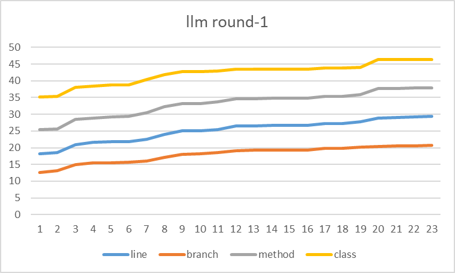

#### Round2

time：2025-05-05-14-07-46

| #    | line  | branch | method | class |
| ---- | ----- | ------ | ------ | ----- |
| 1    | 18.2  | 12.53  | 25.68  | 35.21 |
| 2    | 20.27 | 14.4   | 27.92  | 37.37 |
| 3    | 22.53 | 15.6   | 30.26  | 40.6  |
| 4    | 23.13 | 16.1   | 30.61  | 41.04 |
| 5    | 23.71 | 16.76  | 31.29  | 41.47 |
| 6    | 23.92 | 17.25  | 31.39  | 41.47 |
| 7    | 24.02 | 17.42  | 31.43  | 41.47 |
| 8    | 24.22 | 17.6   | 31.78  | 41.47 |
| 9    | 24.24 | 17.62  | 31.86  | 41.47 |
| 10   | 24.25 | 17.66  | 31.86  | 41.47 |
| 11   | 25.09 | 18.24  | 32.74  | 41.9  |
| 12   | 25.57 | 18.44  | 33.1   | 41.9  |
| 13   | 26.12 | 18.89  | 33.88  | 42.33 |
| 14   | 27    | 19.36  | 34.87  | 43.2  |
| 15   | 27    | 19.36  | 34.87  | 43.2  |
| 16   | 27.81 | 19.89  | 35.83  | 44.06 |
| 17   | 28.81 | 20.36  | 37.21  | 45.36 |
| 18   | 29.07 | 20.43  | 37.6   | 45.36 |
| 19   | 29.07 | 20.43  | 37.6   | 45.36 |
| 20   | 29.07 | 20.47  | 37.6   | 45.36 |
| 21   | 29.07 | 20.47  | 37.6   | 45.36 |
| 22   | 29.46 | 20.66  | 37.96  | 45.57 |
| 23   | 29.46 | 20.67  | 37.96  | 45.57 |

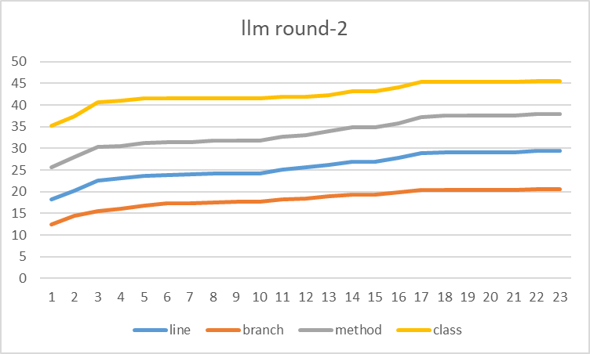

#### Round3

time：2025-05-05-18-04-57

| #    | line  | branch | method | class |
| ---- | ----- | ------ | ------ | ----- |
| 1    | 16.86 | 11.74  | 23.09  | 34.34 |
| 2    | 19.14 | 13.7   | 25.9   | 36.07 |
| 3    | 20.27 | 14.36  | 26.89  | 36.72 |
| 4    | 21.47 | 15.36  | 28.59  | 37.58 |
| 5    | 21.79 | 15.87  | 28.8   | 38.01 |
| 6    | 22.18 | 16.02  | 29.27  | 38.66 |
| 7    | 22.65 | 16.16  | 29.87  | 38.88 |
| 8    | 22.87 | 16.3   | 30.08  | 39.09 |
| 9    | 23.82 | 16.85  | 31.36  | 39.96 |
| 10   | 24.69 | 17.34  | 32.49  | 40.6  |
| 11   | 25.88 | 17.88  | 34.3   | 42.33 |
| 12   | 26.18 | 18.13  | 34.52  | 42.76 |
| 13   | 27.17 | 18.9   | 35.47  | 43.63 |
| 14   | 27.17 | 18.9   | 35.47  | 43.63 |
| 15   | 27.17 | 18.9   | 35.47  | 43.63 |
| 16   | 27.17 | 18.9   | 35.47  | 43.63 |
| 17   | 27.19 | 18.9   | 35.51  | 43.63 |
| 18   | 27.29 | 18.99  | 35.54  | 43.63 |
| 19   | 27.57 | 19.29  | 35.76  | 43.84 |
| 20   | 27.98 | 19.61  | 36.25  | 44.28 |
| 21   | 28.06 | 19.81  | 36.29  | 44.28 |
| 22   | 28.16 | 19.89  | 36.5   | 44.28 |
| 23   | 28.63 | 20.32  | 36.96  | 44.71 |
| 24   | 28.63 | 20.32  | 36.96  | 44.71 |

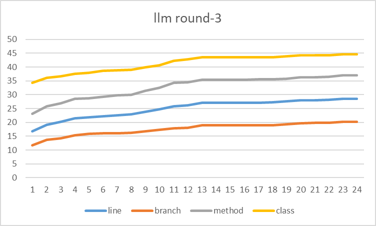

#### Round4

time：2025-05-05-20-22-49

| #    | line  | branch | method | class |
| ---- | ----- | ------ | ------ | ----- |
| 1    | 18.16 | 12.93  | 24.26  | 33.26 |
| 2    | 21.5  | 15.39  | 28.88  | 37.8  |
| 3    | 22.14 | 15.58  | 29.66  | 38.01 |
| 4    | 23.25 | 16.28  | 30.97  | 40.6  |
| 5    | 24.41 | 17.21  | 32.78  | 42.98 |
| 6    | 25.59 | 17.91  | 33.74  | 43.63 |
| 7    | 25.89 | 18.21  | 34.05  | 43.84 |
| 8    | 26.65 | 18.66  | 34.76  | 44.92 |
| 9    | 26.69 | 18.69  | 34.84  | 44.92 |
| 10   | 27.25 | 18.94  | 35.58  | 45.57 |
| 11   | 27.29 | 18.99  | 35.58  | 45.57 |
| 12   | 27.55 | 19.24  | 35.86  | 45.57 |
| 13   | 27.63 | 19.35  | 36.04  | 45.57 |
| 14   | 27.71 | 19.47  | 36.04  | 45.57 |
| 15   | 28.64 | 20.54  | 36.86  | 45.57 |
| 16   | 29.48 | 20.89  | 38.24  | 47.73 |
| 17   | 29.54 | 20.99  | 38.35  | 47.73 |
| 18   | 29.55 | 21     | 38.35  | 47.73 |
| 19   | 29.55 | 21.05  | 38.35  | 47.73 |
| 20   | 30.18 | 21.26  | 38.88  | 48.38 |
| 21   | 30.22 | 21.32  | 38.95  | 48.38 |
| 22   | 30.58 | 21.78  | 39.34  | 48.6  |
| 23   | 30.65 | 21.87  | 39.45  | 48.6  |

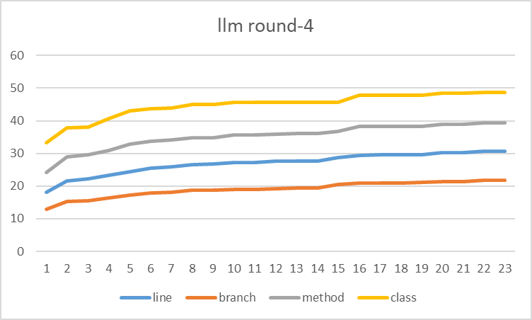

#### Round5

time：2025-05-06-12-13-43

| #    | line  | branch | method | class |
| ---- | ----- | ------ | ------ | ----- |
| 1    | 16.31 | 11.42  | 22.81  | 32.4  |
| 2    | 18.17 | 12.47  | 24.97  | 35.42 |
| 3    | 19.2  | 13.4   | 26.32  | 36.5  |
| 4    | 21.09 | 14.51  | 29.23  | 39.09 |
| 5    | 21.18 | 14.53  | 29.34  | 39.09 |
| 6    | 21.18 | 14.54  | 29.34  | 39.09 |
| 7    | 22.91 | 15.44  | 30.58  | 40.17 |
| 8    | 23.26 | 15.7   | 30.86  | 40.17 |
| 9    | 25    | 17.05  | 32.88  | 41.68 |
| 10   | 25    | 17.06  | 32.88  | 41.68 |
| 11   | 25.03 | 17.17  | 32.92  | 41.68 |
| 12   | 25.27 | 17.3   | 33.24  | 41.9  |
| 13   | 25.35 | 17.45  | 33.31  | 41.9  |
| 14   | 25.52 | 17.78  | 33.42  | 41.9  |
| 15   | 26.09 | 18.16  | 34.13  | 42.55 |
| 16   | 27.47 | 18.99  | 35.86  | 44.06 |
| 17   | 27.7  | 19.32  | 35.97  | 44.06 |
| 18   | 27.7  | 19.32  | 35.97  | 44.06 |
| 19   | 27.7  | 19.33  | 35.97  | 44.06 |
| 20   | 27.99 | 19.55  | 36.18  | 44.49 |
| 21   | 28.65 | 19.68  | 37.42  | 46.44 |
| 22   | 29.29 | 20.27  | 38.24  | 47.3  |
| 23   | 29.35 | 20.31  | 38.28  | 47.3  |

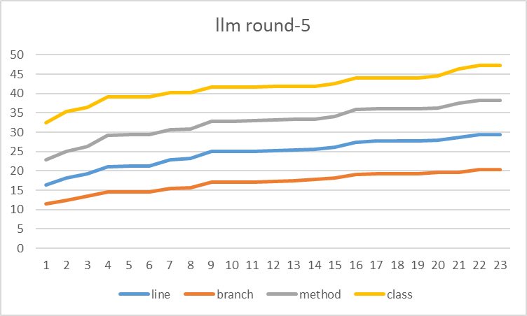


#### Average

| #    | line  | branch | method | class  |
| ---- | ----- | ------ | ------ | ------ |
| 1    | 29.36 | 20.64  | 37.96  | 46.44  |
| 2    | 29.46 | 20.67  | 37.96  | 45.57  |
| 3    | 28.63 | 20.32  | 36.96  | 44.71  |
| 4    | 30.65 | 21.87  | 39.45  | 48.6   |
| 5    | 29.35 | 20.31  | 38.28  | 47.3   |
| avg  | 29.49 | 20.762 | 38.122 | 46.524 |


## 附录4 按钮文本标注Prompt

### User

你好！我有一些按钮文本，希望你可以对它们的功能进行标注，如果不确定某个按钮的功能，那么请猜测一个最接近的。预定义的功能类别有：

```
| ---- | --------- | ------------------------------------------------------------ |
| 1    | 增删改查  | `Save`, `Create a new file`, `Delete`, `Copy`, `Move`, `Add tags`, `Create Toolbar Item`, `Delete Bookmark` |
| 2    | 文本编辑  | `Bold`, `Italic`, `Strike out`, `Heading 1`,`Table`, `Horizontal line`, `Ordered list`,`Document End` |
| 3    | 格式设置  | `Date format`, `Choose format`, `yyyy-MM-dd`                 |
| 4    | 导航跳转  | `Go to`, `QuickNote`, `Log in`                               |
| 5    | 页面操作  | `More options`, `drawer open`, `Sort`, `Collapse`, `Select all`, `Sort Field`, `List view` |
| 6    | 搜索替换  | `Search`, `Replace`, `SEARCH / REPLACE`, `Clear query`       |
| 7    | 配置/设置 | `Load default settings`, `Always use...`, `Keep Editing`     |
| 8    | 一般按钮  | `OK`, `CANCEL`, `HELP`                                       |
| 9    | 其他      | 用户输入的文本、页面提示文字等，`Nothing here!`, `oKgUJ\ny\n\n#Tag1`, `FF8BC34A`, `Open the deck overview page containing the number of cards to see today.` |
```

 需要标注的文本集合为：

```
{ 
 '\nCE', 
 '\r6\r\nZ Tj',
 '#',
 "'Puv",
 '+skVBC',
 '/Ek;',
 '10',
 '10:41 AM',
 '34',
 '35',
 '37.4219983, -122.084',
 '43',
 '5/6/25 9:38 AM \n\n',
 '5O\\XA ',
 '9',
 ':HTt',
 'A=j)/',
 'ADD CATEGORY',
 'Add tags',
 'Answer',
 'App info',
 'Attachment',
 'BACK',
 'BGMD}\rKC  ',
 'CANCEL',
 'CGhLXsGb',
 'CONFIRM',
 'CUSTOM',
 'CUSTOM…',
 'Category',
 'Checklist',
 'Clear query',
 'Close app',
 'Collapse',
 'Confirm answer',
 'Confirm the new password',
 'Confirm undoing changes?',
 'Content',
 'DONE',
 'Deny',
 'Documents',
 'Done',
 'EVERY YEAR',
 'FF8BC34A',
 'FFEC407A',
 'Files',
 'FiywYIjw',
 'FopdnUUT',
 'GtuhuvCW',
 'Insert a new password',
 'KCt ./',
 'Location',
 'MAY 6, 2025',
 'More options',
 'New item',
 'Nothing here!',
 'OK',
 'PASSWORD FORGOTTEN',
 'PM',
 'PRESETS',
 'Previous month',
 'Pushbullet',
 'QFaDlXe',
 'Question',
 'REMOVE CATEGORY',
 'REMOVE PASSWORD',
 'REPEAT DAILY',
 'Record',
 'Remove location?',
 'Remove reminder?',
 'Search',
 'Search in notes',
 'Search location',
 'Share',
 'Sort',
 'T',
 'Tags',
 'Timestamp',
 'Title',
 'USE CURRENT LOCATION',
 'Video',
 'Voice search',
 'WJ',
 'WlqpP',
 'ZSt7E',
 'b0Gt$26*',
 'cf',
 'drawer open',
 'hHCr',
 'l',
 'nK',
 'ngXPA',
 'oKgUJ',
 'oKgUJ\ny\n\n#Tag1',
 'p?Bl;o;y',
 'q\\',
 'ss',
 'w]PU[,bW',
 'y',
 '•',
 '••',
 '•••',
 '••••••',
 '••••••••'
 }
```

 请按以下json格式输出：

```json
{ 
    "List view": 5,
    "OPEN": 4,
    "Delete Bookmark": 1
}
```

### AI

```json
{
    "ADD CATEGORY": 1,
    "Add tags": 1,
    "Answer": 9,
    "App info": 7,
    "Attachment": 9,
    "BACK": 4,
    "CANCEL": 8,
    "CONFIRM": 8,
    "CUSTOM": 3,
    "CUSTOM…": 3,
    "Category": 9,
    "Checklist": 2,
    "Clear query": 6,
    "Close app": 4,
    "Collapse": 5,
    "Confirm answer": 9,
    "Confirm the new password": 9,
    "Confirm undoing changes?": 9,
    "Content": 9,
    "DONE": 8,
    "Deny": 8,
    "Documents": 9,
    "Done": 8,
    "EVERY YEAR": 3,
    "FF8BC34A": 9,
    "FFEC407A": 9,
    "Files": 9,
    "Insert a new password": 9,
    "Location": 9,
    "MAY 6, 2025": 9,
    "More options": 5,
    "New item": 1,
    "Nothing here!": 9,
    "OK": 8,
    "PASSWORD FORGOTTEN": 4,
    "PM": 3,
    "PRESETS": 3,
    "Previous month": 4,
    "Pushbullet": 9,
    "Question": 9,
    "REMOVE CATEGORY": 1,
    "REMOVE PASSWORD": 1,
    "REPEAT DAILY": 3,
    "Record": 9,
    "Remove location?": 1,
    "Remove reminder?": 1,
    "Search": 6,
    "Search in notes": 6,
    "Search location": 6,
    "Share": 1,
    "Sort": 5,
    "Tags": 9,
    "Timestamp": 3,
    "Title": 9,
    "USE CURRENT LOCATION": 4,
    "Video": 9,
    "Voice search": 6,
    "drawer open": 5,
    "#": 9,
    "'Puv": 9,
    "+skVBC": 9,
    "/Ek;": 9,
    "10": 9,
    "10:41 AM": 3,
    "34": 9,
    "35": 9,
    "37.4219983, -122.084": 9,
    "43": 9,
    "5/6/25 9:38 AM \n\n": 3,
    "5O\\XA ": 9,
    "9": 9,
    ":HTt": 9,
    "A=j)/": 9,
    "CE": 9,
    "CGhLXsGb": 9,
    "CUSTOM": 3,
    "FiywYIjw": 9,
    "FopdnUUT": 9,
    "GtuhuvCW": 9,
    "KCt ./": 9,
    "QFaDlXe": 9,
    "WJ": 9,
    "WlqpP": 9,
    "ZSt7E": 9,
    "b0Gt$26*": 9,
    "cf": 9,
    "hHCr": 9,
    "l": 9,
    "nK": 9,
    "ngXPA": 9,
    "oKgUJ": 9,
    "oKgUJ\ny\n\n#Tag1": 9,
    "p?Bl;o;y": 9,
    "q\\": 9,
    "ss": 9,
    "w]PU[,bW": 9,
    "y": 9,
    "•": 2,
    "••": 2,
    "•••": 2,
    "••••••": 2,
    "••••••••": 2,
    "\r6\r\nZ Tj": 9,
    "BGMD}\rKC  ": 9
}
```

